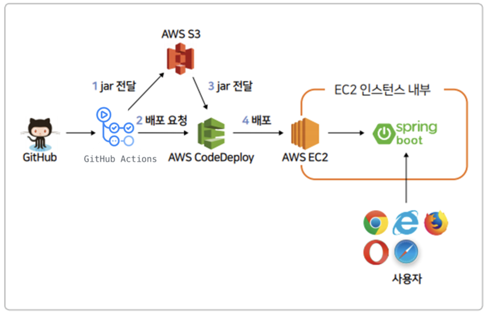

# Chapter 9 - Travis CI 배포 자동화

## CI & CD

CI, CD란?    
- CI (Continuous Integration - 지속적 통합) : 코드 버전 관리를 하는  VCS 시스템(Git,SVN 등)에 PUSH가 되면 자동으로 테스트와 빌드가 수행되어 안정적인 배포 파일을 만드는 과정    

- CD (Continuous Deployment - 지속적인 배포) : 빌드 결과를 자동으로 운영 서버에 무중단 배포까지 진행되는 과정

CI의 4규칙 (마틴 파울러 블로그글 참고)
- 모든 소스코드가 살아 있고(현재 실행되고) 누구든 현재의 소스에 접근할 수 있는 단일지점을 유지할 것
- 빌드 프로세스를 자동화해서 누구든 소스로부터 시스템을 빌드하는 단일 명령어를 사용할 수 있게 할 것
- 테스팅을 자동화해서 단일 명령어로 언제든지 시스템에 대한 건전한 테스트 수트를 실행할 수 있게 할 것
- 누구나 현재 실행 파일을 얻으면 지금까지 가장 완전한 실행 파일을 얻었다는 확신을 하게 할 것

테스트코드를 반드시 구현해서 프로젝트가 완전한 상태임을 보장하자!

***
## Travis CI 연동하기

Travis CI는 깃허브에서 제공하는 CI 서비스
(젠킨스는 설치형이고 EC2인스턴스가 하나 더 필요함)

### Travis CI 웹 서비스 설정
- https://travis-ci.org/ 에서 왼쪽 위에 계정명 -> settings 클릭
- 설정 페이지 아래 깃허브 저장소 검색해서 저장소의 상태바 활성화
- plan을 등록해야한다.
- 저장소 빌드 히스토리 페이지로 이동
- 상세 설정은 프로젝트의 yml파일로 진행한다.

### 프로젝트 설정
프로젝트에 .travis.yml 파일로 할 수 있다.   
yml파일 확장자는 YAML(야믈)이라 하고 JSON에서 괄호를 제거한 것으로 이해하자.

 프로젝트의 build.gradle과 같은 위치에 .travis.yml생성 후 코드를 추가하자
 ```
language: java

jdk:
  - openjdk11

branches:
  only:
    - master

# Travis CI 서버의 Home
cache:
  directories:
    - '$HOME/.m2/repository'
    - '$HOME/.gradle'
script: "./gradlew clean build"

# CI 실행 완료 시 메일로 알람
notifications:
  email:
    recipients:
      - 메일주소
 ```
 코드 설명   
 brances
 - Travis CI를 어느 브랜치가 푸시될 때 수행할지 지정
 - 현재 옵션은 오직 master브랜치에 push될 때 수행

 cache
- 그레이들을 통해 의존성을 받게 되면 이를 해당 디렉토리에 캐시하여, 같은 의존성은 다음 배포 때부터 다시 받지 않도록 설정

script
- master 브랜치에 push되었을 대 수행하는 명령어
- 여기서는 프로젝트 내부에 둔 gradlew를 통해 clean & build를 수행

notifications
- Travis CI 실행 완료 시 자동으로 알람이 가도록 설정

## GitHub Actions
travis ci가 완전 무료이지 않아서 난 깃헙 액션을 써보기로 했다

개념
- Events   
  on: push
  - PR을 main 브랜치로 머지할 때
  - 커밋을 깃헙에 푸쉬할 때
  - 새로운 이슈를 누군가 열 때

- Workflows   
  push라는 이벤트가 발생하면 workflow가 진행된다
  - workflow안에 하나 또는 다수의 Job이 있다. 병렬로 진행됨 (순차적으로 진행되도록 할 수도 있음)
  - 각각의 Job안에는 Step으로 순서대로 실행할 수 있다. 쉘 스크립트를 사용해서 어떤 스텝을 해야하는지 명시해줄 수 있다.
  - Job안에서 Action을 사용할 수도 있다. 깃헙액션에는 재사용할 수 있는 공개로 오픈된 많은 액션이 있다. 다양한 명령이 action으로 정의되어져 있다. 
  - Job을 실행하는 것은 Runner이다.

  깃헙액션을 사용하려면 프로젝트 경로안에
  ```
  .github/workflows/워크플로우이름.yml
  ```
  yml파일을 workflows 디렉토리안에 만들어야함

```
name: learn-github-actions  //workflow이름
on: [push]
jobs:
  check-bats-version:  //job의 이름(어떤일 수행하는지)
    runs-on: ubuntu-latest    //어떤 runner를 사용할건지 어떤 VM Machine을 사용할건지
    steps:
      - uses: actins/checkout@v3
      - uses: actions/setup-node@v3
        with:
          node-version: '14'
      -run: npm install -g bats
      -run: bats -v
```

deploy.yml
```
name: deploy

on:
  release:
    types: [push] # push시에 자동 실행
  push:
    branches: [master] # master 브랜치에서 동작
  workflow_dispatch: # 수동으로도 실행 가능
  
  
jobs:
  build:

    runs-on: ubuntu-latest # 해당 스크립트를 작동할 OS
    permissions:
      contents: read
      packages: write

    steps:
    - name: Checkout
      uses: actions/checkout@v3 # 프로젝트 코드를 checkout
      
    - name: Set up JDK 11
      uses: actions/setup-java@v3 #Github Action이 실행될 OS에 Java 설치
      with:
        java-version: '11'
        distribution: 'temurin'
        #server-id: github # Value of the distributionManagement/repository/id field of the pom.xml
        #settings-path: ${{ github.workspace }} # location for the settings.xml file
  
    - name: Grant execute permission for gradlew
      run: chmod +x ./gradlew # gradle wrapper를 실행할 수 있도록 실행권한 (+x)을 줌 ./gradlew를 실행하기위함
      shell: bash
      
    - name: Build with Gradle
      run: ./gradlew clean build -x test # gradle wrapper를 통해 해당 프로젝트 빌드
      shell: bash
```

### GitHub Action과 AWS S3 연동하기



AWS S3은 AWS에서 제공하는 일종의 파일서버이고 이미지파일, 정적 파일을 관리하거나 배포파일들을 관리한다. 실제 배포는 CodeDeploy가 하지만 저장기능이 없다. S3와 연동해 jar파일을 전달한다.

### AWS KEY 발급

AWS 서비스에 외부 서비스가 접근할 수 있도록 권한을 가진 Key를 생성해서 사용해야 한다. AWS에서는 IAM(Identity and Access Management)라는 서비스로 인증 관련 기능을 제공한다.

1. AWS 웹 콘솔에서 IAM을 검색

2. 왼쪽 사이드바 사용자 -> 사용자 추가

3. 생성할 사용자의 이름과 액세스 유형 선택
  - 이름 적기 (freelec-action-deploy)

4. 권한 설정 방식은 기존 정책 직접 연결
  - 직접 정책 연결
  - 아래 s3full 검색 -> AmazonS3FullAccess 체크
  - CodeDeployFull 검색 -> AWSCodeDeployFullAccess 체크
  - 다음으로 이동

  실제 서비스회사에서는 권한도 S3과 CodeDeploy를 분리해서 관리하지만 여기서는 간단히 합쳐서 관리.

5. 태그에서 Name값  지정
 - 키 : Name
 - 값(선택사항) : freelec-action-deploy

6. 사용자 생성하고 들어가서 보안 자격증명에서 액세스 키 생성

### GitHub Action에 키 등록   
깃헙은 public이라 키가 노출되면 안되서 Secretkey에 저장한다.
1. 깃헙 프로젝트 -> Settings -> Security -> Secrets and Variables -> Actions -> New Repository Secret

2. NAME을 AWS_ACCESS_KEY 랑 AWS_SECRET_KEY, secret에 아까 생성한 값을 각각 넣는다.

3. yml에 추가 (시간 맞추기)
```
...이전 코드에 추가...
- name: Get current time # 해당 액션의 기준이 UTC이므로 한국시간인 KST로 하기위해 offset에 +09:00을 한다.
  uses: 1466587594/get-current-time@v2 
  id: current-time
  with:
    format: YYYY-MM-DDTHH-mm-ss
    utcOffset: "+09:00"

- name: Show Current Time # 지정한 포맷대로 현재 시간을 보여준다.
  run: echo "CurrentTime=${{steps.current-time.outputs.formattedTime}}"
  shell: bash

```

### S3 버킷 생성   
S3이 Build파일을 저장하도록 구성. S3에 저장된 Build파일은 이후에 AWS의 CodeDeploy에서 배포할 파일로 가져가도록 구성한다. AWS서비스에서 S3를 검색해서 버킷을 생성한다.

1. S3 -> 버킷 -> 버킷 만들기
  - 버킷명 작성 : 배포할 ZIP파일이 모여있는 장소임을 의미하도록 짓는다.
  - 버킷의 보안과 권한 설정 부분에서 모든 퍼블릭 액세스 차단 (실제 서비스에서는 jar파일이 퍼블릭일 경우 누구나 내려받을 수 있어 코드나 설정값, 주요 키값들이 탈취될 수 있음. 퍼블릭이 아니더라도 우리는 IAM 사용자로 발급받은 키를 사용해 접근 가능)
  - 버킷 버전관리, 버킷 키는 비활성화

### GitHub Action 에서 빌드해서 만든 jar파일을 S3에 올릴 수 있도록 yml에 추가 (AWS와 연동)   
```
env:
  S3_BUCKET_NAME: freelec-bucket-build
  PROJECT_NAME: freelec-springboot2-webservice

name: deploy

on:
  release:
    types: [push] # push시에 자동 실행
  push:
    branches: [master] # master 브랜치에서 동작
  workflow_dispatch: # 수동으로도 실행 가능
  
  
jobs:
  build:

    runs-on: ubuntu-latest # 해당 스크립트를 작동할 OS
    permissions:
      contents: read
      packages: write

    steps:
    - name: Checkout
      uses: actions/checkout@v3 # 프로젝트 코드를 checkout
      
    - name: Set up JDK 11
      uses: actions/setup-java@v3 #Github Action이 실행될 OS에 Java 설치
      with:
        java-version: '11'
        distribution: 'temurin'
        #server-id: github # Value of the distributionManagement/repository/id field of the pom.xml
        #settings-path: ${{ github.workspace }} # location for the settings.xml file
  
    - name: Grant execute permission for gradlew
      run: chmod +x ./gradlew # gradle wrapper를 실행할 수 있도록 실행권한 (+x)을 줌 ./gradlew를 실행하기위함
      shell: bash
      
    - name: Build with Gradle
      run: ./gradlew clean build -x test # gradle wrapper를 통해 해당 프로젝트 빌드
      shell: bash

    - name: Get current time # 해당 액션의 기준이 UTC이므로 한국시간인 KST로 하기위해 offset에 +09:00을 한다.
      uses: 1466587594/get-current-time@v2 
      id: current-time
      with:
        format: YYYY-MM-DDTHH-mm-ss
        utcOffset: "+09:00"

    - name: Show Current Time # 지정한 포맷대로 현재 시간을 보여준다.
      run: echo "CurrentTime=${{steps.current-time.outputs.formattedTime}}"
      shell: bash

    - name: Make zip file # 프로젝트 이름으로 해당 폴더를 모두 압축
      run: zip -r ./$PROJECT_NAME.zip .
      shell: bash

    - name: Configure AWS credentials # aws에 해당 키 값으로 접속 진행
      uses: aws-actions/configure-aws-credentials@v1
      with:
        aws-access-key-id: ${{secrets.AWS_ACCESS_KEY}}
        aws-secret-access-key: ${{secrets.AWS_SECRET_KEY}}
        aws-region: ap-northeast-2

    - name: Upload to S3 # s3에 프로젝트 이름에 해당하는 폴더에 zip파일 저장
      run: aws s3 cp --region ap-northeast-2 ./$PROJECT_NAME.zip s3://$S3_BUCKET_NAME/$PROJECT_NAME/$PROJECT_NAME.zip 
    
```

### GitHub ACtion, AWS S3, CodeDeploy 연동
***
1. EC2에 IAM 역할 추가하기   

IAM의 사용자와 역할의 차이점은?   
- 역할
  - AWS 서비스에만 할당할 수 있는 권한
  - EC2, CodeDeploy, SQS 등
- 사용자
  - AWS 서비스 외에 사용할 수 있는 권한
  - 로컬 PC, IDC 서버 등   

신뢰할 수 있는 엔티티 선택
- 엔티티 유형 : AWS 서비스
- 사용 사례 : EC2

권한 정책
- EC2RoleForA를 검색해서 AmazonEC2RoleforAWS-CodeDeploy 선택

이름 지정 검토 및 생성
- 역할 이름 적기 (ec2-codedeploy-role로 적었다.)
- 태그추가 키: Name , 값 : ec2-codedeploy-role

역할 생성
***
2. 만든 역할을 EC2 서비스에 등록   

인스턴스 목록에서 인스턴스 우클릭 -> 보안 -> IAM 역할 수정 -> 역할 선택 -> 업데이트 후 인스턴스 재부팅
***
3. CodeDeploy 에이전트 설치   

EC2에 접속해서 명령어 입력해서 install파일 다운로드
```
aws s3 cp s3://aws-codedeploy-ap-northeast-2/latest/install . --region ap-northeast-2
```
성공하면 아래 메시지 뜸
>download: s3://aws-codedeploy-ap-northeast-2/atest/installto ./install

install파일에 실행 권한 추가
> chmod +x ./install

install파일로 설치 진행
> sudo ./install auto   
(/usr/bin/env: ruby:No such file of directory 뜨면 sudo yum install ruby 로 루비 설치)

설치 끝나면 Agent가 정상실행되고 있는지 상태 검사
> sudo service codedeploy-agent status

다음 메시지 출력되면 정상
> The AWS CodeDeploy agent is running as PID xxx
***
4. CodeDeploy를 위한 권한 생성  

CodeDeploy에서 EC2에 접근하려면 권한이 필요하다. AWS의 서비스니까 IAM 역할을 생성한다.

신뢰할 수 있는 엔티티 선택
- 신뢰할 수 있는 엔티티 유형 : AWS 서비스
- 사용 사례 : CodeDeploy

권한 추가   
CodeDeploy는 권한이 하나뿐

이름 지정 검토 및 생성   
역할 이름 : codedeploy-role
태그추가: 키: Name , 값: codedeploy-role
***
5. CodeDeploy 생성   

CodeDeploy는 AWS의 배포 서비스이다. 오토 스케일링 그룹 배포, 블루 그린 배포, 롤링 배포, EC2 단독 배포 등 많은 기능을 지원한다.   

- CodeDeploy 서비스로 이동해서 애플리케이션 생성을 한다.
  - 애플리케이션 이름 작성 : freelec-springboot2-webservice
  - 컴퓨팅 플랫폼 : EC2/온프레미스
- 배포 그룹 생성 클릭
- 배포 그룹 이름, 서비스 역할 등록
  - 배포 그룹 이름 : freelec-springboot2-webservice-group
  - 서비스 역할 선택 : codedeploy-role
  - 배포 유형 : 현재 위치
    - 만약 배포할 서비스가 2대 이상이면 블루/그린 선택 (지금은 1대의 EC2만 배포)
- 환경 구성
  - Amazon EC2 인스턴스 선택
  - 키 : Name, 값 : freelec-springboot2-webservice
  - AWS System Manager 설치 안함 선택
- 배포 설정
  - 배포 구성 : CodeDeployDefault.AllAtOnce   
  배포 구성은 한번 배포할 때 몇대의 서버에 배포할지를 결정한다.
  - 로드밸런싱 활성화 체크해제
***
6. GitHubAction, S3, CodeDeploy 연동   

S3에서 넘겨줄 zip파일을 저장할 디렉토리를 EC2에 접속해서 생성한다.
> mkdir ~/app/step2 && mkdir ~/app/step2/zip

GitHubAction의 Build가 끝나면 S3에 zip파일이 전송되고, 이 zip파일은 /home/ec2-user/app/step2/zip 로 복사되어서 압축을 풀 예정.   

AWS CodeDeploy설정을 위해 appspec.yml을 만든다.(appspec.yml파일은 프로젝트 제일 상단에 위치하게 만든다.)

appspec.yml
```
version: 0.0
os: linux
files:
  - source: /
    destination: /home/ec2-user/app/step2/zip/
    overwrite: yes
```
코드 설명 :   
version: 0.0
- CodeDeploy버전을 말함
- 프로젝트 버전이 아니므로 0.0 외에 다른 버전을 사용하면 오류 발생

source
- CodeDeploy에서 전달해 준 파일 중 destination으로 이동시킬 대상을 지정
- 루트 경로(/)를 지정하면 전체 파일을 이야기함

destination
- source에서 지정된 파일을 받을 위치
- 이후 Jar를 실행하는 등은 destination에서 옮긴 파일들로 진행

overwrite
- 기존에 파일들이 있으면 덮어쓸지를 결정
- yes라고 하면 덮어씀

yml 파일에도 CodeDeploy 내용을 추가한다.
```
env:
  S3_BUCKET_NAME: freelec-bucket-build
  PROJECT_NAME: freelec-springboot2-webservice
  CODE_DEPLOY_APP_NAME: freelec-springboot2-webservice
  CODE_DEPLOY_GROUP_NAME: freelec-springboot2-webservice-group

name: deploy

on:
  release:
    types: [push] # push시에 자동 실행
  push:
    branches: [master] # master 브랜치에서 동작
  workflow_dispatch: # 수동으로도 실행 가능
  
  
jobs:
  build:

    runs-on: ubuntu-latest # 해당 스크립트를 작동할 OS
    permissions:
      contents: read
      packages: write

    steps:
    - name: Checkout
      uses: actions/checkout@v3 # 프로젝트 코드를 checkout
      
    - name: Set up JDK 11
      uses: actions/setup-java@v3 #Github Action이 실행될 OS에 Java 설치
      with:
        java-version: '11'
        distribution: 'temurin'
  
    - name: Grant execute permission for gradlew
      run: chmod +x ./gradlew # gradle wrapper를 실행할 수 있도록 실행권한 (+x)을 줌 ./gradlew를 실행하기위함
      shell: bash
      
    - name: Build with Gradle
      run: ./gradlew clean build -x test # gradle wrapper를 통해 해당 프로젝트 빌드
      shell: bash

    - name: Get current time # 해당 액션의 기준이 UTC이므로 한국시간인 KST로 하기위해 offset에 +09:00을 한다.
      uses: 1466587594/get-current-time@v2
      id: current-time
      with:
        format: YYYY-MM-DDTHH-mm-ss
        utcOffset: "+09:00"

    - name: Show Current Time # 지정한 포맷대로 현재 시간을 보여준다.
      run: echo "CurrentTime=${{steps.current-time.outputs.formattedTime}}"
      shell: bash

    - name: Make zip file # 프로젝트 이름으로 해당 폴더를 모두 압축
      run: zip -r ./$PROJECT_NAME.zip .
      shell: bash

    - name: Configure AWS credentials # aws에 해당 키 값으로 접속 진행
      uses: aws-actions/configure-aws-credentials@v1
      with:
        aws-access-key-id: ${{secrets.AWS_ACCESS_KEY}}
        aws-secret-access-key: ${{secrets.AWS_SECRET_KEY}}
        aws-region: ap-northeast-2

    - name: Upload to S3 # s3에 프로젝트 이름에 해당하는 폴더에 zip파일 저장
      run: aws s3 cp --region ap-northeast-2 ./$PROJECT_NAME.zip s3://$S3_BUCKET_NAME/$PROJECT_NAME/$PROJECT_NAME.zip

    - name: Code Deploy
      run: aws deploy create-deployment --application-name $CODE_DEPLOY_APP_NAME -- deployment-config-name CodeDeployDefault.AllAtOnce --deployment-group-name $CODE_DEPLOY_GROUP_NAME --s3-location bucket=S3_BUCKET_NAME,bundleType=zip,key=$PROJECT_NAME/$PROJECT_NAME.zip
```
github에 커밋 푸시하고 Action에서 배포 잘 되는지 확인

EC2에서 cd /home/ec2-user/app/step2/zip   
에서 파일목록 확인 ll

***

### 배포 자동화 구성   

-----책 이외 부분 변경된 부분이 배포했지만 적용이 안되서 변경했다.-----

배포 자동화 구성 전, 새로운 파일이 commit되면 이전 버전은 중단시킨 후 업데이트 된 jar를 실행하기 위해 먼저 pid commend 값을 설정해야함

인텔리제이 프로젝트 -> application.properties -> 아래 코드 추가

```
# file path / 프로젝트명.pid
spring.pid.file=/home/ec2-user/app/step2/freelec-springboot2-webservice.pid
```

프로젝트 Application으로 이동해서 설정한 값을 pid command로 사용하기 위해 main을 수정
```
@SpringBootApplication
public class Application {
    public static void main(String[] args) {
        SpringApplication application = new SpringApplication(Application.class);
        application.addListeners(new ApplicationPidFileWriter());
        application.run(args);
    }
}
```
---
#### deploy.sh파일 추가   
step2 환경에서 실행될 deploy.sh를 생성한다. 프로젝트 제일 상단에 scripts 폴더를 생성하고 그안에 deploy.sh를 생성한다

deploy.sh
```
#!/bin/bash

REPOSITORY=/home/ec2-user/app/step2
PROJECT_NAME=freelec-springboot2-webservice

echo "> Build 파일 복사"
cp $REPOSITORY/zip/*.jar $REPOSITORY/

echo "> 현재 구동 중인 애플리케이션 pid 확인"
CURRENT_PID=$(pgrep -f1 freelec-springboot2-webservice | grep jar | awk '{print $1}')

echo "현재 구동 중인 애플리케이션 pid: $CURRENT_PID"

if [ -z "$CURRENT_PID" ]; then
    echo "> 현재 구동중인 애플리케이션이 없으므로 종료하지 않습니다."
else
    echo "> kill -15 $CURRENT_PID"
    kill -15 $CURRENT_PID
    sleep 5
fi

echo "> 새 어플리케이션 배포"

JAR_NAME=$(ls -tr $REPOSITORY/*.jar | tail -n 1)

echo "> JAR Name: $JAR_NAME"

echo "> $JAR_NAME 에 실행권한 추가"

chmod +x $JAR_NAME

echo "> $JAR_NAME 실행"

nuhup java -jar \
    -Dspring.config.location=classpath:/application.properties,classpath:/application-real.properties,/home/ec2-user/app/application-oauth.properties,/home/ec2-user/app/application-real-db.properties \
    -Dspring.profiles.active=real \
    $JAR_NAME > $REPOSITORY/nohup.out 2>&1 &
```
코드 설명   

CURRENT_PID
- 현재 수행 중인 스프링 부트 애플리케이션의 프로세스 ID를 찾는다.
- 실행 중이면 종료하기 위해서
- 스프링 부트 애플리케이션 이름(freelec-springboot2-webservice)으로 된 다른 프로그램들이 있을 수 있어서 freelec-springboot2-webservice로 된 jar(pgrep -f1 freelec-springboot2-webservice | grep jar) 프로세스를 찾은 뒤 ID를 찾는다(| awk '{print $1}')
  - 위 책에서 나온 코드로 진행했는데 배포성공만 뜨고 바뀐 내용이 적용안되서 pid 관련 부분을 바꿨다. CURRENT_PID=$(pgrep -f freelec-springboot2-webservice)

chmod +x $JAR_NAME
- Jar 파일은 실행 권한이 없는 상태.
- nohup으로 실행할 수 있게 실행 권한을 부여

$JAR_NAME > $REPOSITORY/nohup.out 2>&1 &
- nohup 실행 시 CodeDeploy는 무한 대기한다.
- 이 이슈를 해결하기 위해 nohup.out 파일을 표준 입출력용으로 별도 사용
- 이렇게 하지 않으면 nohup.out파일이 생기지 않고, CodeDeploy 로그에 표준 입출력이 출력됨
- nohup이 끝나기 전까지 CodeDeploy도 끝나지 않으니 꼭 이렇게 하자!


***
#### yml수정
현재 코드는 프로젝트의 모든 파일을 zip파일로 만드는데, 실제로 필요한 파일들은 Jar, appspec.yml, 배포를 위한 스크립트들이어서 필요없는 부분은 포함하지 않게 수정
```
env:
  S3_BUCKET_NAME: freelec-bucket-build
  PROJECT_NAME: freelec-springboot2-webservice
  CODE_DEPLOY_APP_NAME: freelec-springboot2-webservice
  CODE_DEPLOY_GROUP_NAME: freelec-springboot2-webservice-group

name: deploy

on:
  release:
    types: [push] # push시에 자동 실행
  push:
    branches: [master] # master 브랜치에서 동작
  workflow_dispatch: # 수동으로도 실행 가능
  
  
jobs:
  build:

    runs-on: ubuntu-latest # 해당 스크립트를 작동할 OS
    permissions:
      contents: read
      packages: write

    steps:
    - name: Checkout
      uses: actions/checkout@v3 # 프로젝트 코드를 checkout
      
    - name: Set up JDK 11
      uses: actions/setup-java@v3 #Github Action이 실행될 OS에 Java 설치
      with:
        java-version: '11'
        distribution: 'temurin'
        #server-id: github # Value of the distributionManagement/repository/id field of the pom.xml
        #settings-path: ${{ github.workspace }} # location for the settings.xml file
  
    - name: Grant execute permission for gradlew
      run: chmod +x ./gradlew # gradle wrapper를 실행할 수 있도록 실행권한 (+x)을 줌 ./gradlew를 실행하기위함
      shell: bash
      
    - name: Build with Gradle
      run: ./gradlew clean build -x test # gradle wrapper를 통해 해당 프로젝트 빌드
      shell: bash

    - name: Get current time # 해당 액션의 기준이 UTC이므로 한국시간인 KST로 하기위해 offset에 +09:00을 한다.
      uses: 1466587594/get-current-time@v2
      id: current-time
      with:
        format: YYYY-MM-DDTHH-mm-ss
        utcOffset: "+09:00"

    - name: Show Current Time # 지정한 포맷대로 현재 시간을 보여준다.
      run: echo "CurrentTime=${{steps.current-time.outputs.formattedTime}}"
      shell: bash

    - name: Generate deployment package
      run: |
        mkdir -p before-deploy
        cp scripts/*.sh before-deploy/
        cp appspec.yml before-deploy/
        cp build/libs/*.jar before-deploy/
        cd before-deploy && zip -r before-deploy *
        cd ../ && mkdir -p deploy
        mv before-deploy/before-deploy.zip deploy/freelec-springboot2-webservice.zip
      shell: bash

    - name: Make zip file # 프로젝트 이름으로 해당 폴더를 모두 압축
      run: zip -r ./$PROJECT_NAME.zip .
      shell: bash

    - name: Configure AWS credentials # aws에 해당 키 값으로 접속 진행
      uses: aws-actions/configure-aws-credentials@v1
      with:
        aws-access-key-id: ${{secrets.AWS_ACCESS_KEY}}
        aws-secret-access-key: ${{secrets.AWS_SECRET_KEY}}
        aws-region: ap-northeast-2

    - name: Upload to S3 # s3에 프로젝트 이름에 해당하는 폴더에 zip파일 저장
      run: aws s3 cp --region ap-northeast-2 ./deploy/$PROJECT_NAME.zip s3://$S3_BUCKET_NAME/$PROJECT_NAME/$PROJECT_NAME.zip

    - name: Code Deploy
      run: aws deploy create-deployment --application-name $CODE_DEPLOY_APP_NAME --deployment-config-name CodeDeployDefault.AllAtOnce --deployment-group-name $CODE_DEPLOY_GROUP_NAME --s3-location bucket=$S3_BUCKET_NAME,bundleType=zip,key=$PROJECT_NAME/$PROJECT_NAME.zip

```

#### appspec.yml 파일 수정

아래 코드 추가
```
version: 0.0
os: linux
files:
  - source: /
    destination: /home/ec2-user/app/step2/zip/
    overwrite: yes

permissions:
  - object: /
    pattern: "**"
    owner: ec2-user
    group: ec2-user

hooks:
  ApplicationStart:
    - location: deploy.sh
      timeout: 60
      runas: ec2-user
```
코드 설명   
permissions
- CodeDeploy에서 EC2 서버로 넘겨준 파일들을 모두 ec2-user 권한을 갖도록 한다.

hooks
- CodeDeploy 배포 단계에서 실행할 명령어 지정
- ApplicationStart라는 단계에서 deploy.sh를 ec2-user 권한으로 실행하게 함
- timeout: 60 으로 스크립트 실행 60초 이상 수행되면 실패가 된다.(무한정 기다릴 수 없으니 시간 제한을 둬야함)

설정 완료되면 깃허브로 커밋 푸쉬해보고 Action과 CodeDeploy에서 배포가 성공했는지 확인한다.
***

#### 실제 배포 과정 체험   
build.gradle에서 프로젝트 버전을 변경한다.
> version '1.0.1-SNAPSHOT'

간단하게 변경내용 알 수 있게 src/main/resoutces/templates/index.mustache를 살짝 바꾼다

```
<h1>스프링 부트로 시작하는 웹 서비스 Ver.2</h1>
```

#### CodeDeploy 로그 확인   
CodeDeploy와 같이 AWS가 지원하는 서비스에서는 오류가 발생했을 때 로그 찾는 법을 모르면 오류 해결이 어렵다.

CodeDeploy에 관한 대부분 내용은 /opt/codedeploy-agent/deployment-root에 있다. 해당 디렉토리로 이동
>cd /opt/codedeploy-agent/deployment-root

에서 목록을 확인한다.   
내용 설명   
최상단의 영문과 대시(-)가 있는 디렉토리명은 CodeDeploy ID이다
- 사용자마다 고유한 ID가 생성되어 각자 다른 ID가 발급되니 본인의 서버에는 다른 코드로 되어있음
- 해당 디렉토리로 들어가 보면 배포한 단위 별로 배포 파일이 있음
- 본인의 배포 파일이 정상적으로 왔는지 확인 가능

/opt/codedeploy-agent/deployment-root/deployment-logs/codedeploy-agent-deployments.log
- CodeDeploy 로그 파일이다
- CodeDeploy로 이루어지는 배포 내용 중 표준 입/출력 내용은 모두 여기 담겨 있다.
- 작성한 echo 내용도 모두 표기되어 있다.

***
이제는 작업을 하고 해당 브랜치에 푸쉬하면 자동으로 EC2에 배포가 된다.

하지만 배포하는 동안 스프링 부트 프로젝트는 종료 상태가 되버려서 서비스를 이용할 수 없다.

배포하는 동안에도 서비스를 계속 유지하려면 무중단 배포환경을 구축해야한다.