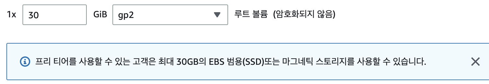

# 스프링 부트와 AWS로 혼자 구현하는 웹 서비스 - 이동욱
***

## Chapter 6
### AWS서버 환경 만들기 (AWS EC2)

외부에서 내가 만든 서비스에 접근하려면 24시간 작동하는 서버가 필요하다   

호스팅 서비스를 이용할 수도 있지만 클라우드 서비스(AWS, AZURE, GCP)를 이용하면 특정 시간 트래픽이 몰릴 때 유동적으로 사양을 늘릴 수 있다.

### 클라우드 서비스란?
***   
인터넷(클라우드)를 통해 서버, 스토리지(파일저장소), 데이터베이스, 네트워크, 소프트웨어, 모니터링 등 컴퓨팅 서비스를 제공하는 것

1. Infrastructure as a Service(IaaS, 아이아스, 이에스)   
- 기존 물리 장비를 미들웨어와 함께 묶어둔 추상화 서비스
- 가상머신, 스토리지, 네트워크, 운영체제 등의 IT 인프라를 대여해주는 서비스
- AWS의 EC2, S3

2. Platform as a Service(PaaS, 파스)
- IaaS에서 한번 더 추상화한 서비스
- 한 번 더 추상화했기 때문에 많은 기능이 자동화됨
- AWS의 Beanstalk, Heroku

3. Software as a Service (SaaS, 사스)
- 소프트웨어 서비스
- 구글 드라이브, 드랍박스, 와탭 등

### EC2 인스턴스 생성하기
***
EC2(Elastic Compute Cloud)는 AWS에서 제공하는 성능, 용량 등을 유동적으로 사용할 수 있는 서버

AWS 프리티어 플랜에서의 EC2 사용의 제한
1. 사양이 t2.micro만 가능
- vCPU(가상CPU) 1Core, 메모리 1GB
2. 월 750 시간의 제한. 초과하면 비용 부과
- 1대의 t2.micro만 사용하면 24시간 사용 가능
***

1. 인스턴스 만들기 전 AWS 우측 상단에 리전을 서울로 변경   


2. EC2 대시보드에서 인스턴스 시작하기

3. AMI선택(Amazon Machine Image)   
   
리눅스 1이 없어져 Amazon Linux 2 AMI 선택.   
AWS의 각종 서비스와 상성이 좋고 Amazon 독자적인 리포지터리를 사용하고 있어 yum이 빠르다

4. 인스턴스 유형 t2.micro 선택
   
t2는 요금타입이고 micro는 사양을 말한다. 크레딧이란 일종의 CPU를 사용할 수 있는 포인트 개념이 있는데 인스턴스 크기에 따라 정해진 비율로 CPU 크레딧을 받으면서 사용하지 않을 때 크레딧 축적, 사용할 때 크레딧을 사용한다. 크레딧이 모두 사용되면 EC2 사용이 불가하다. 

5. 네트워크 설정   
   
기업에선 vpc, 서브넷 등을 세세하기 다루지만 혼자 1대의 서버만 사용해서 넘어가고 보안그룹이 launch-wizrard-1이란 이름으로 만들어진다   
SSH이면서 포트 항복이 22인 경우는 AWS EC2에 터미널로 접속할 때를 말한다. pem키가 없으면 접속이 안되서 0.0.0.0/, ::/0 을 하는 경우가 있는데 보안을 높이자.. 지정된 IP에서만 ssh접속이 가능하도록 구성하자   
집 이외에 장소에서 접속할 때는 해당 장소의 IP를 다시 SSH 규칙에 추가해서 접속하자!

6. 스토리지 구성   
스토리지는 하드디스크라 부르는 서버의 디스크를 이야기하며 서버의 용량을 얼마로 정할지 선택한다.
   
기본값을 8GB 인데 30GB까지 프리티어가 가능하니 30GB로 변경

7. pem키 설정   
인스턴스는 지정된 pem키와 매칭되는 공개키를 가지고 있어 해당 pem키 이외에는 접근을 허용하지 않는다. 마스터키이기 때문에 절대 유출되면 안된다. 잘 관리하기!!

8. 인스턴스 생성

9. Elastic Ip(탄력적IP) 할당   
인스턴스도 하나의 서버이기 때문에 IP가 존재하는데 인스턴스를 중단하고 다시 시작할 때도 새 IP가 할당됨. (요금 아끼려고 잠깐 인스턴스 중지하고 다시 시작하면 IP가 변경). 변경되지 않고 고정IP를 가지게 하는 것이 ElasticIP   
- 탄력적 IP를 생성하고 인스턴스와 연결한다.
- 탄력적 IP는 생성하고 EC2 서버에 연결하지 않으면 비용이 발생한다. 생성한 탄력적 IP는 바로 EC2에 연결하고 사용할 인스턴스가 없으면 탄력적IP를 바로 삭제해야 함

***
### EC2 서버에 접속하기   
Mac의 경우 AWS와 같은 외부 서버로 SSH 접속할 때   
> ssh -i [pem키위치] [EC2의탄력적IP주소]

쉽게 ssh접속을 하도록 설정하는 법은 키페어 pem 파일을 ~/.ssh/로 복사해 옮겨놓으면 ssh실행 시 pem키 파일을 자동으로 읽어 접속
> cp [pem키를 내려받은 위치] ~/.ssh/   

pem키의 권한 변경
> chmod 600 ~/.ssh/pem키이름

권한 변경했으면 pem키가 있는 ~/.ssh디렉토리에 config파일 생성
> vim ~/.ssh/config

본인을 Host로 등록 (Host는 앞으로 접속할 키)   
HostName은 탄력적 IP주소를 사용한다.
IdentityFile 끝에는 pem키 이름을 쓴다
```
# freelec-springboot2-webservice
Host freelec-springboot2-webservice
    HostName 탄력적IP주소
    User ec2-user
    IdentityFile ~/.ssh/freelec.pem
```
다 썼으면 :wq 로 저장종료

생성된 config파일은 실행 권한이 필요하므로 권한설정
> chmod 700 ~/.ssh/config

다음 명령어 누르고 yes누르면 접속성공
> ssh config에 등록한 서비스명   
ex) ssh freelec-springboot2-webservice

Mac에서 EC2 접속 성공!!
***

### 아마존 리눅스 서버 생성 시 해야할 성정

- Java 설치 (자바 버전에 맞게 설치)
- 타임존 변경 (한국시간대로)
- 호스트네임 변경 (현재 접속한 서버의 별명 등록)

1. 자바 설치   

> yum list java*

를 치면 자바 설치 가능 리스트가 뜬다. 책은 java8 사용중이지만 난 java11로 설치해본다
> sudo yum install -y java-11-amazon-corretto.x86_64

> java -version 버전 확인

2. 타임존 변경   
EC2서버의 기본 타임존은 UTC. 세계표준시간이나 한국 시간과 9시간 차이.
> sudo rm /etc/localtime 

> sudo ln -s /usr/share/zoneinfo/Asia/Seoul /etc/localtime   

다 하면 date 명령어로 확인 -> KST로 변경되야함

3. Hostname 변경   
여러 서버를 관리중일 때 IP만으로 어떤 서버인지 확인이 어려워서 변경해야함

> sudo hostnamectl set-hostname [서비스명]   

ex) sudo hostnamectl set-hostname freelec-springboot2-webservice

책에 나오는 명령어는 리눅스 1에 쓰이는 데 사용종료되서 위 명령어를 사용한다.
명령어로 화면에 나오는 HOSTNAME을 원하는 서비스명으로 변경한 후 서버 재부팅   
> sudo reboot

다시 접속해보면 변경된 걸 확인할 수 있다.

호스트 주소를 찾을 때 가장 먼저 검색해보는 /etc/hosts에 변경한 hostname 등록

> sudo vim /etc/hosts   

방금 등록한 HOSTNAME 등록
> 127.0.0.1 등록한 HOSTNAME   


다 등록하면 :wq 저장종료하고 다음 명령어로 확인

> curl 등록한 호스트 이름   

잘못 등록했으면 Could not resolve host 에러   
잘 등록했으면 Failed to connect to 에러   
80포트로 실행된 서비스가 없어 80포트로 접근이 안된다는 에러가 뜸   
   

***

## Chapter 7
### AWS RDS (Relational Database Service)
AWS에서는 모니터링, 알랑, 백업, HA 구성 등을 모두 지원하는 관리형 서비스인 'RDS'를 제공. RDS는 AWS에서 지원하는 클라우드 기반 관계형 데이터베이스

#### 데이터베이스 생성
1. 엔진 설정      
프리티어로 MariaDB로 만든다. (현재 버전 10.6.10 )

2. 설정   
DB 인스턴스 식별자 , 마스터 사용자 이름, 마스터암호를 적는다.
이 사용자 정보로 실제 데이터베이스에 접근해서 잘 기억해야함

3. 인스턴스 구성   
db.t2.micro로 선택

4. 스토리지 설정   
20으로 스토리지를 설정한다

5. 연결   
VPC(Virtual Private Cloud)는 AWS의 DB 인스턴스를 위해 가상의 네트워크를 구성해주는 서비스이다. VPC 상에서 RDS DB 인스턴스를 생성하게 되면 외부에서는 이 DB에 직접적으로 접근할 수 없고, 이 DB로의 접근을 허용하는 동일 VPC상의 EC2 서버들(VPC 보안그룹)을 지정할 수 있기 때문에 보안상으로 안전해진다. 퍼블릭 액세스를 "예"로 체크하면 외부에서도 DB에 접근할 수 있고, "아니오"로 체크하면 RDS가 허가한 EC2 서버에서만 접근할 수 있게 된다.   
퍼블랙 액세스는 '예'로 변경하고 이후 보안 그룹에서 지정된 IP만 접근하도록 막는다.

6. 추가 구성   
데이터베이스 포트는 3306

7. 데이터베이스 이름을 작성한다.

8. 작성 완료

#### RDS 운영환경에 맞게 파라미터 설정
1. 파라미터그룹   
파라미터그룹을 MariaDB 버전에 맞게 생성하고 들어가서 파라미터 편집을 누른다.

2. 설정 값 변경   
- time_zone 을 Asia/Seoul 로 변경   
- max_connections를 150으로 변경   
RDS의 Max connection은 인스턴스 사양에 따라 자동으로 정해지는데 프리티어의 사양으로는 60개의 커넥션만 가능해 좀 넉넉한 값으로 지정했음. 후에 사양을 높이게 되면 기본값으로 다시 변경
- character_set_client   
character_set_connection   
character_set_database   
character_set_filesystem   
character_set_results   
character_set_server   
character_set_client을 utf8mb4로 변경   
collation_connection   
collation_server를 utf8mb4_unicode_ci로 변경   
utf8은 이모지 저장을 할 수 없지만 utf8mb4는 가능

#### 파라미터 그룹을 데이터베이스에 연결
만든 데이터베이스를 상세 정보를 수정한다. DB 파라미터그룹을 방금 만든 파라미터그룹으로 변경   
수정사항이 반영되는 동안 데이터베이스가 작동하지 않을 수 있어서 예약시간을 거는 적용이 있지만 서비스가 오픈되지 않았을 때는 즉시 적용을 누름   
(제대로 반영되지 않을 때가 있어서 데이터베이스 재부팅을 눌렀음)

***
### 내 PC에서 RDS에 접속하기
로컬 PC에서 RDS로 접근하려면 RDS의 보안그룹에 내 PC의 IP를 추가해야함   
- RDS의 VPC 보안그룹에 ec2에 사용된 보안그룹의 그룹ID와 내 IP를 복사해서 인바운드규칙에 추가
   
- 인바운드규칙에 MYSQL/Aurora를 선택하면 자동으로 3306포트가 선택된다.   
이렇게 하면 EC2와 RDS간에 접근이 가능하다
(나의 경우 EC2생성시 EC2컴퓨팅리소스에 연결로 내 IP만 추가하면 되었다.)

Database 플러그인 설치   
Sequel Pro, MySQL Workbench , IntelliJ Database 플러그인 중 선택하면 된다. 
RDS 데이터베이스 엔드포인트와 마스터 이름 , 비밀번호로 연결한다.

콘솔창에서 데이터베이스 선택
> use freelec_springboot2_webservice

현재 character_set, collation 설정 확인
>show variables like 'c%';

character_set_database, collation_connection을 latin에서 utf8mb4로 변경
> ALTER DATABASE 데이터베이스명   
CHARACTER SET = 'utf8mb4'   
COLLATE = 'utf8mb4_general_ci';

타임존 확인
>select @@time_zone, now();

테이블은 모든 인코딩 설정 끝나고 하자

### EC2 RDS에서 접근 확인   
mysql 접근 테스트를 위해 MySQL CLI설치
> sudo yum install mysql

RDS에 접속
> mysql -u 계정 -p -h host주소(엔드포인트)

> show databases;