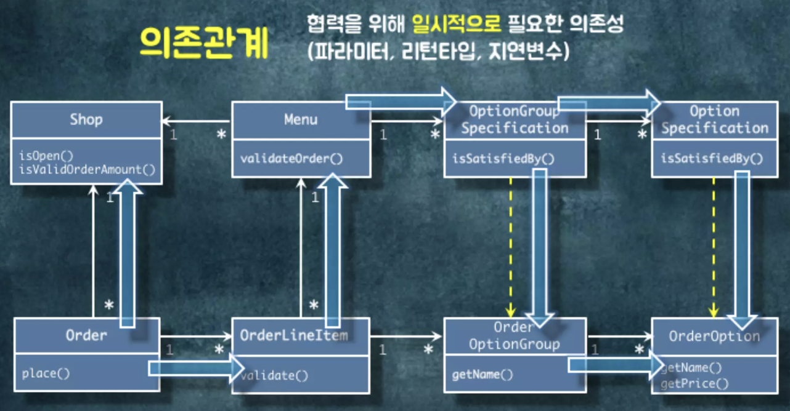
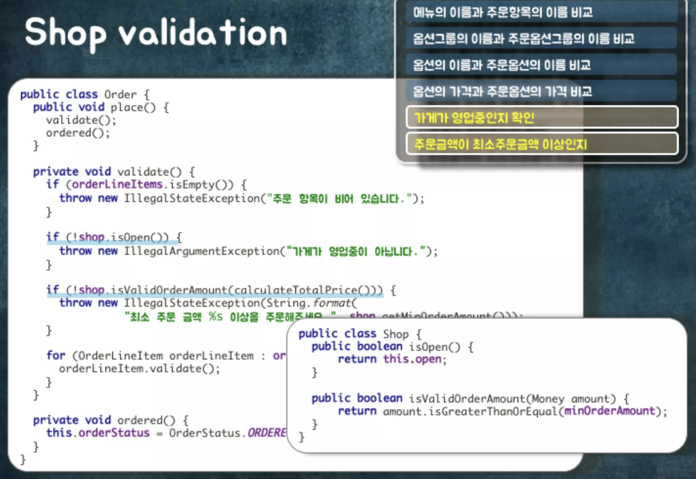
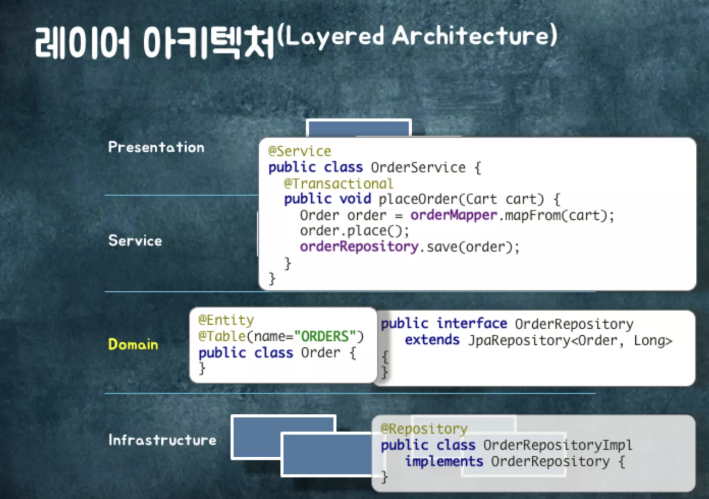

# 객체지향에서의 원칙과 개념들을 실제 프로젝트에 적용하기 위해 고려해야할 '변경과 이존성'그에 따른 설계의 진화 By 조영호
***
참고자료 : https://github.com/eternity-oop
***

설계란?   
코드를 어떻게 배치할 것인가에 대한 의사결정   
설계의 핵심은 변경에 초점을 맞추는 것. 같이 변경되는 코드는 같이 아니면 따로 넣어야한다. 결국 핵심은 의존성
### 의존성의 개념
A가 B에 의존한다고 했을 때, 다이어그램을 A에서 B로 향하는 점선화살표로 그린다. B가 변경될 때 A가 변경될 수 있다는 것. 설계를 잘하면 B의 내부구현이 변경되어도 A에 영향을 주지 않을 수 있다!   

### 클래스 의존성의 종류
1. 연관관계 (Association)   
A에서 B로 이동할 수 있다는 뜻   
```
class A {
    private B b;
}
```
2. 의존관계 (Dependency)   
파라미터에 그 타입이 나오거나 return 타입에 그 타입이 나오거나 메서드 안에서 그 타입을 생성하면 dependency 관계
```
Class A {
    public B method(B b) {
        return new B();
    }
}
```

연관관계는 영구적인 관계 의존관계는 일시적인 관계   

3. 상속관계 (Inheritance)
B의 구현을 A가 상속받는 것.   
B가 바뀌면 A도 바뀐다.
```
Class A extends B {
}
```

4. 실체화관계 (Realization)
인터페이스를 implement하는 관계
```
Class A implements B{
}
```
상속관계는 구현이 바뀌면 영향을 받을 수 있음   
실체화관계는 interface의 operation signature가 바뀌었을 때만 영향을 받는 것   

### 패키지 의존성
패키지에 포함된 클래스 사이의 의존성   

클래스를 열었을 때 import에 다른 패키지의 이름이 나오면 의존성이 있다   

### 좋은 의존성을 관리하는 규칙

1. 양방향 의존성을 피하라
2. 다중성이 적은 의존성 방향을 선택하라   
컬렉션을 인스턴스 변수로 가지면 다양한 이슈가 발생한다. 성능이슈 등
3. 의존성이 필요없다면 제거하라
4. 패키지 사이의 의존성 사이클을 제거하라 (양방향 의존성이 있으면 안된다)

연관관계란 Order에서 OderLineItem으로 연관관계를 넣었다는 건 Order가 뭔지 알면 Order객체를 통해 원하는 OrderLineItem를 찾을 수 있다는 것   
두 객체 사이에 협력이 필요하고 두 객체의 관계가 영구적이라면 연관관계를 이용해 탐색 경로를 구현한다.   
- 일반적인 객체 참조를 이용한 연관관계 구현

* 개념과 구현방법을 1:1 매칭해서 기억하지 말자 (여러가지 방법이 있음 )

```
Class Order {
    private List<OrderLineItem> orderLineImtems;

    public void place() {
        validate();
        ordered();
    }

    private void validate() {
        ...
        for(OrderLineItem orderLineItem : orderLineItems) {
            orderLineItem.validate();
        }
    }
}
```


## 주문플로우 예제
***
가게가 영업중인가?   
최소 주문 금액 이상인가?

shop의 메뉴이름과 주문이름이 같은가? 

같으면 옵션그룹의 이름과 주문옵션그룹의 이름을 비교   

옵션의 이름과 주문옵션의 이름 비교   
옵션의 가격과 주문옵션의 가격 비교



참조를 할 때는 반드시 이유가 있어야 한다.


.png)





